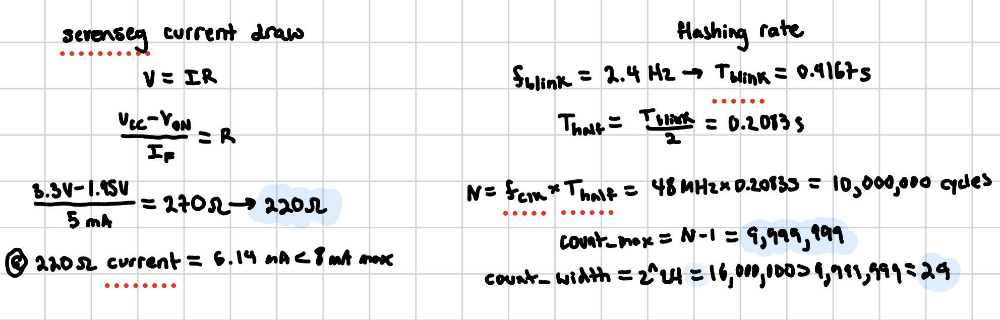
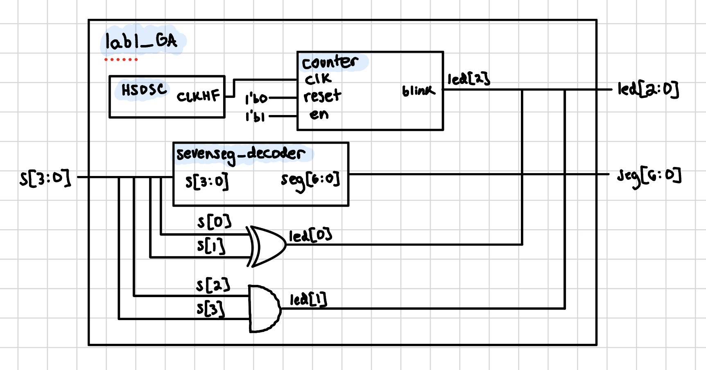
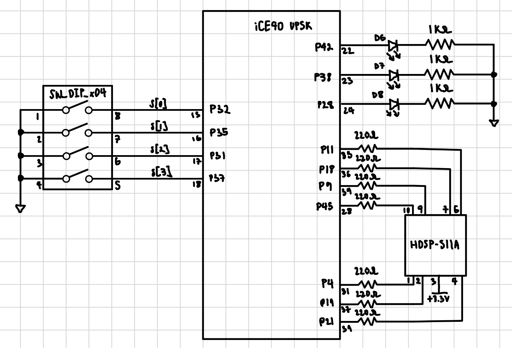
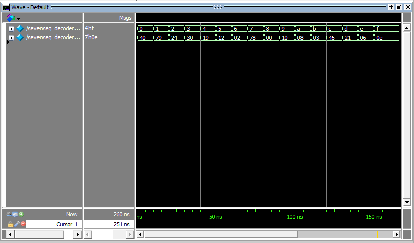
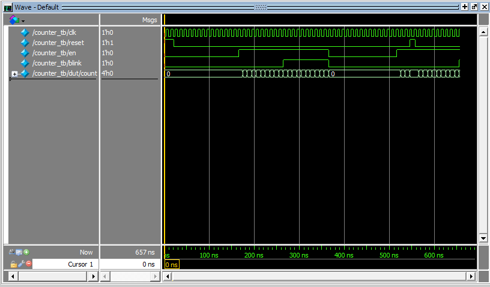
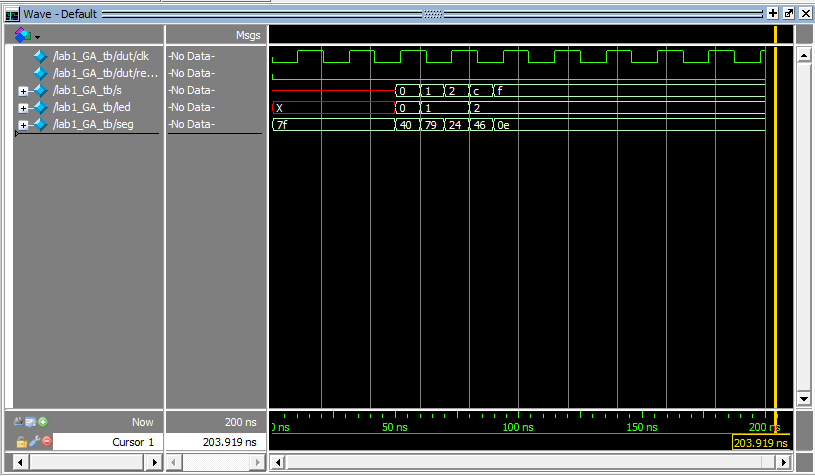

## Introduction

In this lab, a design was implemented on the FPGA that reads four
DIP switches and drives both a seven-segment display and three individual LEDs.
The display shows the hexadecimal digit corresponding to the switch value, two
LEDs are driven by combinational logic on the switches, and a third LED blinks at
2.4 Hz using a counter clocked by the FPGA's internal high-speed oscillator.

The design was developed in SystemVerilog and verified in simulation using
Siemens QuestaSim before being synthesized in Lattice Radiant and programmed onto
the FPGA.

## Design and Testing Methodology

The design was split into three modules:

- **sevenseg_decoder.sv** - combinational logic that maps a 4-bit hex value to
  a common-anode display.
- **counter.sv** - a parameterized counter with synchronous enable and asynchronous
  reset. It counts to a settable MAX value, wraps to zero, and toggles its
  blink output on each wrap.
- **lab1_GA.sv** - the top-level module, which instantiates the HSOSC, the
  decoder, and the counter, and contains only the switch-to-LED assign statements.

Each module was verified with its own testbench, with the scope of each testbench
chosen to match the kind of module under test:

- **sevenseg_decoder_tb.sv** - all 16 possible input combinations were exercised and the segment
  output checked against the expected pattern for each.
- **counter_tb.sv** - the counter is sequential and was tested for the following behavior: reset returns the count to zero, enable input starts and
  stops counting, and the counter wraps at MAX and toggles blink each time.
  time.
- **lab1_GA_tb.sv** - since the submodules were already verified individually, the
  top-level testbench only covers the clock, that the submodules are wired correctly,
  and that the top-level assign statements behave correctly.

After simulation, the design was synthesized in Lattice Radiant, pin assignments
were made, and the bitstream was programmed to the
FPGA's SPI flash using openFPGALoader. The design was then verified on hardware
by stepping through all sixteen switch positions and confirming each hexadecimal
digit was displayed clearly, the two combinational LEDs
followed their truth tables, and that the third LED blinked at
approximately 2.4 Hz.

## Technical Documentation

The source code, block diagram, and schematic for this lab can be found in this
[GitHub repository](https://github.com/GabeAlencar/hmc-e155-portfolio/labFiles/lab1).

### Equations

The resistor value was calculated by taking $V_{cc}$ and $V_{on}$ and dividing by $5\text{mA}$ to get a resistance of around $220 \Omega$. 

The $2.4 \text{Hz}$ blink was produced by choosing MAX and WIDTH so that one counter period equals
half a blink period.

### Block Diagram

### Schematic

## Results and Discussion

The design met all of the prescribed objectives. All sixteen hexadecimal values
were displayed clearly on the seven-segment display. The two combinational LEDs responded correctly
to the switch inputs in all cases and the third LED blinked at the intended
2.4 Hz rate. 

### Testbench Simulation

The following simulations were run in QuestaSim to verify the design before
programming it onto hardware. 

Figure 4 shows the decoder being driven through all sixteen possible input
values. The seg output matches the expected active-low pattern for every
digit, verifying the combinational logic.

Figure 5 shows the counter's behavior with WIDTH = 4 and MAX = 9. The count
holds at zero while the enable input is low, counts from 0 to 9 when enabled,
wraps back to zero at the maximum count, and toggles blink each time it wraps.
blink holds its value between wraps, producing a square wave whose period is
twice the counter period. The asynchronous reset is also shown returning the
count to zero mid-count.

Figure 6 shows the top-level module. The internally generated HSOSC clock is
visible toggling, s steps through several test values, and seg and led respond accordingly.

## Conclusion

The design successfully displayed all sixteen hexadecimal digits on a
seven-segment display, drove two LEDs with combinational logic from four input
switches, and blinked a third LED at 2.4 Hz using the FPGA's internal
oscillator. The MCU was also programmed and verified to communicate with the
FPGA. I spent a total of 20 hours working on this lab.

## AI Prototype Summary

The quality of the output was good in some ways and bad in others. First, the logic was correct. The clock-division, toggle, and logic in place of wire/reg was all perfect. What failed was specific knowledge about the lab. For example, it forgot to negate the output of the counter and left it as positive to light the LED. The model also used very different formatting and naming conventions. The model used .CLKHF_DIV to request a divided-down 12 MHz clock straight from the oscillator. This is a feature the datasheet describes but every example I've seen always takes the oscillator's raw 48 MHz output and does the division itself, which is what my own counter module does. 

Something worth mentioning was initializing registers at declaration rather than relying on an external reset signal. That a bug I had to fix when I forgot to instantiate the registers and got a bunch of x's in my simulation. Seeing the LLM independently do this made me realize that the kinds of mistakes people and AI make are very different. AI tends to assume it knows everything and will make mistakes based on these assumptions. Humans tend to make smaller and more stupid mistakes. Next time, I'd state the target toolchain explicitly in the prompt by saying "using Lattice Radiant". 