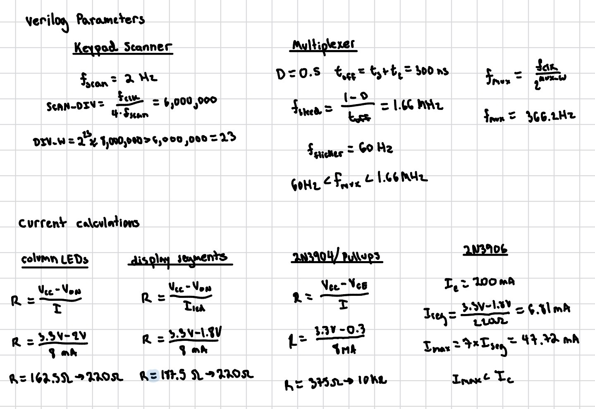
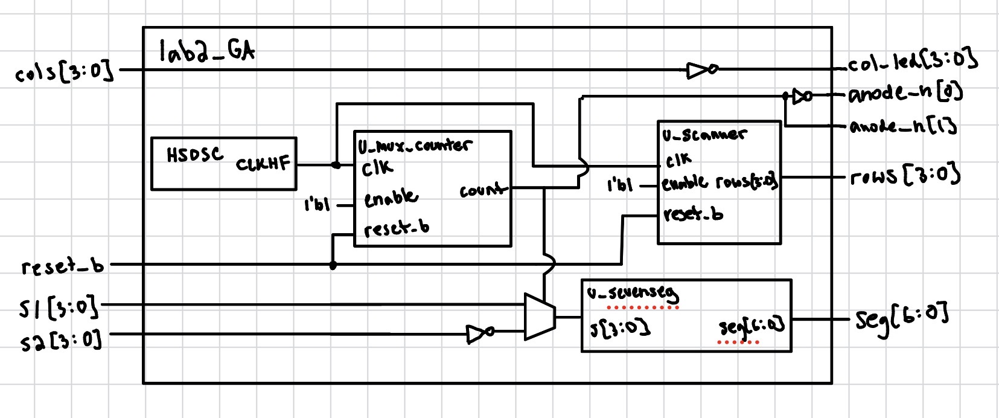
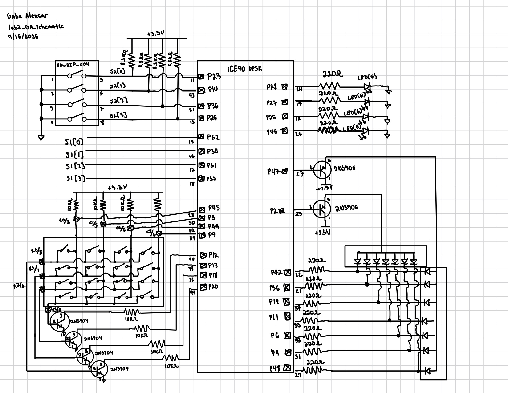

## Introduction

In this lab, a design was implemented on the FPGA that drives two digits of a
dual common-anode seven-segment display using a single, shared decoder module,
and scans a 4x4 keypad by rotating an active row signal while reading the
columns back through a bank of LEDs. Two 4-bit DIP switch banks set the hex digit shown on each display digit. The digits are multiplexed in
time onto a shared set of segment lines, with only one digit's anode enabled
at any instant, switching fast enough that both digits appear to be lit
continuously. A row scanner rotates a single one-hot active
signal through the four keypad rows at 2 Hz, and whichever column line is
pulled low by a pressed key is inverted onto an LED so the keypress is
visible.

As in Lab 1, the design was developed in SystemVerilog, verified in simulation
with Siemens QuestaSim, then synthesized in Lattice Radiant and programmed
onto the FPGA.

## Design and Testing Methodology

The design reuses counter.sv and sevenseg_decoder.sv from Lab 1,
and adds one new module:

- **sevenseg_decoder.sv** - Combinational logic that maps
  a 4-bit hex value to an active-low common-anode segment pattern.
- **counter.sv** - A parameterized counter with
  synchronous enable and asynchronous active-low reset that counts to a
  settable MAX and wraps to zero. It is instantiated twice in this lab. Once as the digit-multiplexing counter in lab2_GA, and once inside
  scanner.sv.
- **scanner.sv** - A single free-running counter counts up to 4*DIV - 1
  clock cycles. The count is compared against DIV, 2*DIV, and 3*DIV to
  decode a one-hot pattern that drives the keypad rows.
- **lab2_GA.sv** - the top-level module, containing only lower-level module
  instantiations and assign statements.

Each new piece of logic was verified with its own testbench, and per the spec
no Lab 1 testbenches (sevenseg_decoder_tb.sv, counter_tb.sv) were rerun,
since those modules are unchanged:

- **scanner_tb.sv** - drives the module directly with small DIV/DIV_W
  parameters and checks, reset drives rows to row 0; holding enable low
  keeps the scanner on row 0, the scanner advances row 0 -> 1 -> 2 -> 3
  and wraps back to row 0. It also checks that disabling en mid-scan
  freezes the current row and reset correctly returns the scanner to row 0
  even while it is actively running.
- **lab2_GA_tb.sv** - since counter and sevenseg_decoder were already
  verified individually, this testbench covers the new top-level wiring. It
  confirms the HSOSC instance produces a toggling clock, that digit 1 is selected out of reset with the decoder wired correctly, that col_led
  correctly inverts two different cols patterns, that the anode mux
  switches to digit 2 after half of MUX_MAX cycles with the decoder still
  wired correctly, that the mux wraps back to digit 1 after a full period,
  and that the row scanner advances by one row after SCAN_DIV cycles.

After simulation, the design was synthesized in Lattice Radiant, pin
assignments were made and the bitstream was
programmed to the FPGA's SPI flash using openFPGALoader.

## Technical Documentation

The source code, testbenches, and pin constraints for this lab can be found in
this [GitHub repository](https://github.com/GabeAlencar/hmc-e155-portfolio/tree/main/labFiles/lab2).

### Equations

### Block Diagram

Figure 2 shows the top-level module's block diagram.

### Schematic

Figure 3 shows the complete board-level schematic. s1[3:0] is wired to one
bank of the board's onboard DIP switches. See the E155 course
schematic for the full detail on how the switches, connectors, and power
rails on the board are wired.

## Results and Discussion

The design was programmed onto the FPGA and verified on hardware. Both
seven-segment digits displayed the hex values set on switch banks s1 and
s2 simultaneously with no visible flicker or bleed-through between digits,
and pressing a key on the keypad lit the corresponding column LED during that
key's row's active scan slot.

### Testbench Simulation

The following simulations were run in QuestaSim to verify the design before
programming it onto hardware.

Figure 4 shows the scanner being reset, held while enable is low, and then
advancing through rows 1 -> 2 -> 4 -> 8 -> 1 every DIV clock cycles once
enabled, confirming the one-hot row rotation and reset behavior.

Figure 5 shows the top-level module. The internally generated HSOSC clock
toggles throughout, mux_count is counting and selecting
between s1 and ~s2 at the decoder input, anode_n and seg switch between digits 1 and 2 in lockstep with digit_sel, and col_led
tracks the inverse of cols throughout.

## Conclusion

The design successfully multiplexed two hexadecimal digits onto a shared
seven-segment decoder and scanned a keypad's rows at 2 Hz while reflecting
column presses onto LEDs, reusing the counter and decoder modules built in
Lab 1. I spent a total of 25 hours working on this lab.

## AI Prototype Summary

For this lab, I prompted an AI twice to generate the two-digit multiplexing
logic that lab2_GA implements. Both attempts got the
high-level idea right. The first attempt reinvented the toggle and decoder from scratch instead of
reusing my existing counter.sv and sevenseg_decoder.sv. After I told it to reuse the existing modules,
the second attempt correctly instantiated both counter and
sevenseg_decoder, and even repurposed counter with WIDTH=1, MAX=1 as a
one-bit toggling oscillator to drive the select signal, which was a clever reuse of code.

What both attempts got wrong, and what neither prompt fixed, was the
physical structure of the display. Both models assumed each digit had its
own dedicated seg0 and seg1 output bus, decoding each nibble into its own
registered seven-segment word. On the actual board the two common-anode
digits share a single seg bus, so the real design has to mux the nibble
into one decoder before decoding, then use anode_n to pick which physical
digit is illuminated with that value. Neither model had this
board-specific detail. The second attempt also introduced a new bug while
fixing the first. It triggered on the rising edge of reset_b and reset the
registers whenever reset_b was high, inverting the active-low convention (like what I did in lab1). Next time I'd give
the AI the board's physical pin and multiplexing structure up front to give it a better idea and chance of getting it right the first time.