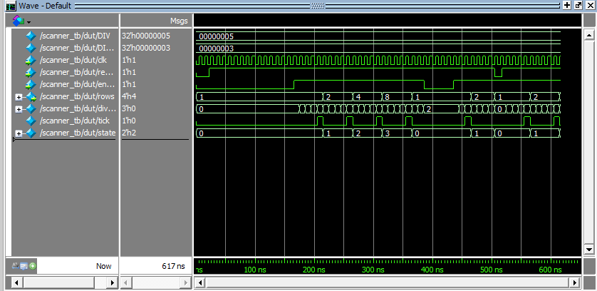
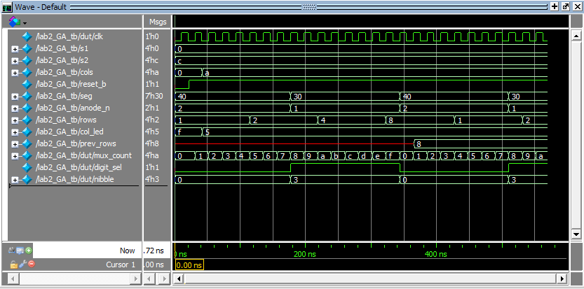

## Introduction

In this lab, a design was implemented on the FPGA that drives two digits of a
dual common-anode seven-segment display using a single, shared decoder module,
and scans a 4x4 keypad by rotating an active row signal while reading the
columns back through a bank of LEDs. Two 4-bit DIP switch banks, `s1` and `s2`,
set the hex digit shown on each display digit. The digits are multiplexed in
time onto a shared set of segment lines, with only one digit's anode enabled
at any instant, switching fast enough that both digits appear to be lit
continuously. Independently, a row scanner rotates a single one-hot active
signal through the four keypad rows at 2 Hz, and whichever column line is
pulled low by a pressed key is inverted onto an LED so the keypress is
visible.

As in Lab 1, the design was developed in SystemVerilog, verified in simulation
with Siemens QuestaSim, then synthesized in Lattice Radiant and programmed
onto the FPGA.

## Design and Testing Methodology

The design reuses `counter.sv` and `sevenseg_decoder.sv` unchanged from Lab 1,
and adds one new module:

- **sevenseg_decoder.sv** - unchanged from Lab 1. Combinational logic that maps
  a 4-bit hex value to an active-low common-anode segment pattern.
- **counter.sv** - unchanged from Lab 1. A parameterized counter with
  synchronous enable and asynchronous active-low reset that counts to a
  settable `MAX` and wraps to zero. It is instantiated three times in this
  lab: once as the digit-multiplexing counter, and twice inside `scanner.sv`.
- **scanner.sv** - a new module built only from `counter` instances and assign
  statements, as required by the spec. A `DIV`-cycle prescaler counter
  produces a `tick` pulse once every `DIV` clock cycles; that tick enables a
  second, 2-bit counter (`MAX = 3`) that free-runs through states 0-3. The
  current state is decoded into a one-hot, rotating 4-bit pattern
  (`rows = 4'b0001 << state`) that drives the keypad rows. Both counters share
  the module's `reset_b` and `enable` inputs, so the whole scanner is
  resettable and can be gated on or off from the top level.
- **lab2_GA.sv** - the top-level module. Per the architecture spec, it
  contains only primitive/module instances and assign statements: an `HSOSC`
  instance for the clock, one `counter` instance for digit multiplexing, one
  `scanner` instance for the keypad rows, and a single `sevenseg_decoder`
  instance shared by both digits.

`lab2_GA.sv` walks through the following logic:

- `mux_count` is a 17-bit counter with `MAX` set to its full range
  (`2**MUX_W - 1`), so it free-runs and wraps on overflow instead of resetting
  early.
- `digit_sel` is simply the counter's MSB (`mux_count[MUX_W-1]`), so it spends
  exactly half of each `2**MUX_W`-cycle period low and half high, giving each
  digit equal on-time.
- `nibble` selects which switch bank feeds the shared decoder: `s1` while
  `digit_sel` is low, and `~s2` while it is high. `s2` is bit-inverted before
  the mux because switch bank 2 is wired with the opposite polarity from bank
  1 on this board, so inverting it in logic keeps both digits reading the
  correct hex value from the decoder, which expects active-high nibbles.
- `anode_n` is built directly from `digit_sel` as `{~digit_sel, digit_sel}`,
  driving exactly one of the two common anodes low (active) at a time and
  leaving the other high (off).
- `scan_en` is tied to `1'b1` so the keypad scanner free-runs continuously;
  it is left as its own signal (rather than wiring `1'b1` straight into the
  port) so it can later be gated by other logic without touching the instance
  itself.
- `col_led = ~cols` inverts the four column inputs directly onto the four
  column LEDs. Each column line idles high and is pulled low when a pressed
  key in the currently-active row shorts it, so the inversion turns "column
  pulled low" into "LED driven high," lighting the LED for whichever
  column(s) are pressed during that row's active slot.

Each new piece of logic was verified with its own testbench, and per the spec
no Lab 1 testbenches (`sevenseg_decoder_tb.sv`, `counter_tb.sv`) were rerun,
since those modules are unchanged:

- **scanner_tb.sv** - drives the module directly with small `DIV`/`DIV_W`
  parameters and checks: reset drives `rows` to row 0; holding `enable` low
  keeps the scanner parked on row 0; the scanner advances row 0 -> 1 -> 2 -> 3
  and wraps back to row 0, each after `DIV` clock edges; disabling mid-scan
  freezes the current row; and reset correctly returns the scanner to row 0
  even while it is actively running.
- **lab2_GA_tb.sv** - since `counter` and `sevenseg_decoder` were already
  verified individually, this testbench covers the new top-level wiring: it
  confirms the HSOSC instance produces a toggling clock, that digit 1 (`s1`)
  is selected out of reset with the decoder wired correctly, that `col_led`
  correctly inverts two different `cols` patterns, that the anode mux
  switches to digit 2 after half of `MUX_MAX` cycles with the decoder still
  wired correctly, that the mux wraps back to digit 1 after a full period,
  and that the row scanner advances by one row after `SCAN_DIV` cycles.

After simulation, the design was synthesized in Lattice Radiant, pin
assignments were made in the `.pdc` constraints file, and the bitstream was
programmed to the FPGA's SPI flash using openFPGALoader.

## Technical Documentation

The source code, testbenches, and pin constraints for this lab can be found in
this [GitHub repository](https://github.com/GabeAlencar/hmc-e155-portfolio/tree/main/labFiles/lab2).

### Equations

<!-- TODO: add resistor current-limiting calculations and figure, matching
     the style of Figure 1 in the Lab 1 report -->

Two timing parameters drive the visible behavior of the design, both derived
from the FPGA's internal 48 MHz `HSOSC` clock:

**Digit refresh rate.** `MUX_W = 17`, so `digit_sel` toggles every
$2^{16} = 65536$ clock cycles and a full two-digit refresh period is
$2^{17} = 131072$ cycles:

$$f_{\text{refresh}} = \frac{48\text{e6 Hz}}{2^{17}} \approx 366\text{ Hz}$$

This is well above the flicker-fusion threshold, which is why both digits
appear to be lit simultaneously with no visible flicker or brightness
difference between them.

**Keypad row scan rate.** The prescaler in `scanner.sv` ticks once every
`SCAN_DIV = 6,000,000` cycles, and the 2-bit state counter advances once per
tick and wraps every 4 ticks (one full row rotation):

$$f_{\text{tick}} = \frac{48\text{e6 Hz}}{6\text{e6}} = 8\text{ Hz}, \qquad
f_{\text{rotation}} = \frac{f_{\text{tick}}}{4} = 2\text{ Hz}$$

This lands exactly on the 2 Hz row-rotation rate called for in the spec.

*(Resistor value calculations for the segment and column LEDs will be added
here once the schematic is finalized.)*

### Block Diagram

*(To be added.)*

### Schematic

*(To be added.)*

## Requirement Compliance

- **Verilog architecture:** the top module (`lab2_GA.sv`) instantiates only
  `HSOSC`, the digit-mux `counter`, `scanner`, and the shared
  `sevenseg_decoder`, plus assign statements — no bare sequential logic lives
  at the top level. `scanner.sv` itself is built only from `counter`
  instances and assign statements, and exposes its own `reset_b`/`enable`
  ports. All counting logic lives inside the parameterized `counter.sv`
  module reused directly from Lab 1, satisfying both the proficiency and
  excellence architecture requirements.
- **Simulation:** `scanner_tb.sv` exercises every row transition, the enable
  gate, and reset (including reset while running), and `lab2_GA_tb.sv`
  exercises the digit mux and column-LED logic automatically with
  self-checking assertions, satisfying the excellence-level simulation
  requirements. Lab 1's testbenches were not rerun, per spec.
- **Hardware:** the shared-decoder multiplexing scheme, 366 Hz digit refresh
  rate, and 2 Hz row scan rate are all in place in the design and confirmed
  in simulation; final confirmation of current-limiting resistor values and
  the open-drain/pull-up wiring needed for simultaneous keypresses is pending
  the schematic and equations above.

## Results and Discussion

The design was programmed onto the FPGA and verified on hardware: both
seven-segment digits displayed the hex values set on switch banks `s1` and
`s2` simultaneously with no visible flicker or bleed-through between digits,
and pressing a key on the keypad lit the corresponding column LED during that
key's row's active scan slot.

### Testbench Simulation

The following simulations were run in QuestaSim to verify the design before
programming it onto hardware.



Figure 1 shows the scanner being reset, held while `enable` is low, and then
advancing through rows `1 -> 2 -> 4 -> 8 -> 1` every `DIV` clock cycles once
enabled, confirming the one-hot row rotation and reset behavior.



Figure 2 shows the top-level module. The internally generated HSOSC clock
toggles throughout, `mux_count` free-runs and its MSB (`digit_sel`) selects
between `s1` and `~s2` at the decoder input (`nibble`), `anode_n` and `seg`
switch between digits 1 and 2 in lockstep with `digit_sel`, and `col_led`
tracks the inverse of `cols` throughout.

## Conclusion

The design successfully multiplexed two hexadecimal digits onto a shared
seven-segment decoder and scanned a keypad's rows at 2 Hz while reflecting
column presses onto LEDs, reusing the counter and decoder modules built in
Lab 1. *I spent a total of [X] hours working on this lab.*

## AI Prototype Summary

For this exercise I ran the same request through an AI coding assistant
twice, in two separate conversations, to see how much the result changed once
the assistant had my actual Lab 1 files to work from.

**Attempt 1 - no context.** I gave the assistant only the prompt from the
assignment: *"Write SystemVerilog HDL to time multiplex a single seven
segment decoder (that decodes from four bits to a common anode seven segment
display) to decode two sets of input bits and drive two sets of seven output
bits."* It returned something along these lines:

```systemverilog
module sevenseg_mux_top (
    input  logic       clk,
    input  logic       rst,
    input  logic [3:0] digit0,
    input  logic [3:0] digit1,
    output logic [6:0] seg0,
    output logic [6:0] seg1
);
    logic        sel;
    logic [3:0]  mux_digit;
    logic [6:0]  mux_seg;
    logic [19:0] clkdiv;

    always_ff @(posedge clk or posedge rst)
        if (rst) clkdiv <= 0;
        else     clkdiv <= clkdiv + 1;

    assign sel = clkdiv[19];

    always_comb mux_digit = sel ? digit1 : digit0;

    seven_seg_decoder decoder (.digit(mux_digit), .seg(mux_seg));

    always_ff @(posedge clk or posedge rst)
        if (rst) begin
            seg0 <= 7'b1111111;
            seg1 <= 7'b1111111;
        end else if (sel) seg1 <= mux_seg;
        else               seg0 <= mux_seg;
endmodule
```

Taken literally, the prompt asks for "two sets of seven output bits," and
that's exactly what the model gave me: two independent 7-bit output buses,
`seg0` and `seg1`, each latched from the shared decoder on alternating clock
edges. That satisfies the words of the prompt but misses the entire point of
hardware time-multiplexing a seven-segment display — a real multiplexed
display has one shared set of segment lines and toggles which digit's
*anode* is active, so it needs one 7-bit output plus a digit-select signal,
not two static 7-bit outputs. This is a case where the AI's output is
internally consistent and synthesizable-looking, but wrong for the actual
hardware problem because the prompt itself was ambiguous about what "two sets
of output bits" should mean. It also assumed a generic active-high `rst` and
an external `clk` input, with no awareness that this board's reset is
active-low and its clock comes from an internal `HSOSC` primitive.

**Attempt 2 - with Lab 1 files attached.** In a fresh conversation, I attached
`counter.sv`, `sevenseg_decoder.sv`, and `lab1_GA.sv`, and asked for the same
functionality but specified: *"Use the seven segment decoder and oscillator
provided in the attached files."* The result was much closer to a real
multiplexed design:

```systemverilog
module lab2_top (
    input  logic [3:0] s1,
    input  logic [3:0] s2,
    input  logic       reset_b,
    output logic [6:0] seg,
    output logic [1:0] anode_n
);
    logic       clk;
    logic [16:0] mux_count;
    logic       sel;
    logic [3:0] nibble;

    HSOSC hf_osc (.CLKHFPU(1'b1), .CLKHFEN(1'b1), .CLKHF(clk));

    counter #(.WIDTH(17), .MAX(131071)) mux_counter (
        .clk(clk), .reset_b(reset_b), .enable(1'b1), .count(mux_count)
    );

    assign sel    = mux_count[16];
    assign nibble = sel ? s2 : s1;

    sevenseg_decoder decoder (.s(nibble), .seg(seg));

    assign anode_n = sel ? 2'b01 : 2'b10;
endmodule
```

With the actual `counter` and `sevenseg_decoder` modules as context, the model
reused them directly instead of reinventing a decoder, reused the `HSOSC`
instantiation pattern from `lab1_GA.sv`, correctly picked up the board's
active-low `reset_b`, and produced one shared `seg` bus with a proper
`anode_n` digit-select signal — the same overall architecture I ended up
using in `lab2_GA.sv`. The one thing it didn't know to do was invert `s2`;
without seeing the actual switch wiring on my board, it had no way to know
bank 2's polarity is flipped relative to bank 1, so both digits would have
displayed complementary values on hardware until I fixed that by hand.

**Reflection.** The gap between the two attempts came down entirely to
context. Without it, the assistant answered the literal prompt and produced
something that compiles but doesn't do real hardware multiplexing; with the
Lab 1 files attached, it inferred the intended architecture correctly and
reused my own modules almost exactly as I would have. Neither version was
synthesized in Radiant as of this writing — *(Radiant synthesis
results/warnings for both attempts to be added here.)* The main workflow
lesson is the same one from Lab 1: when a prompt is ambiguous about hardware
intent (like "two sets of output bits" for what should really be one
multiplexed bus), it pays to either attach the actual project files or state
the target hardware behavior explicitly, rather than relying on the model to
infer it. Next time I would also proactively call out board-specific details
like switch polarity, since those aren't recoverable from source files alone.
