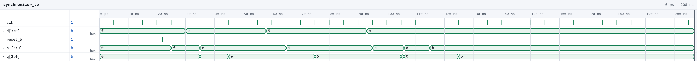
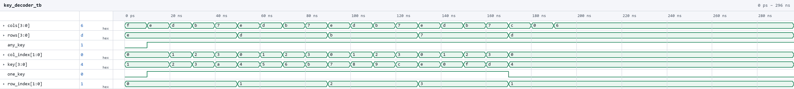
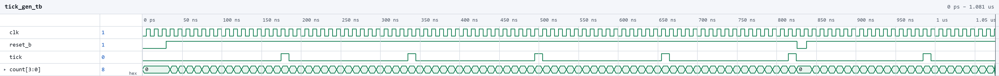
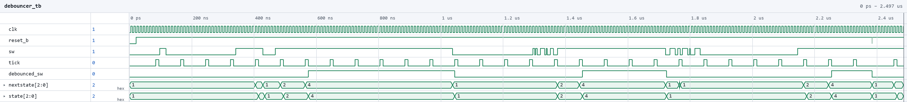
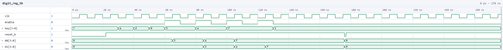
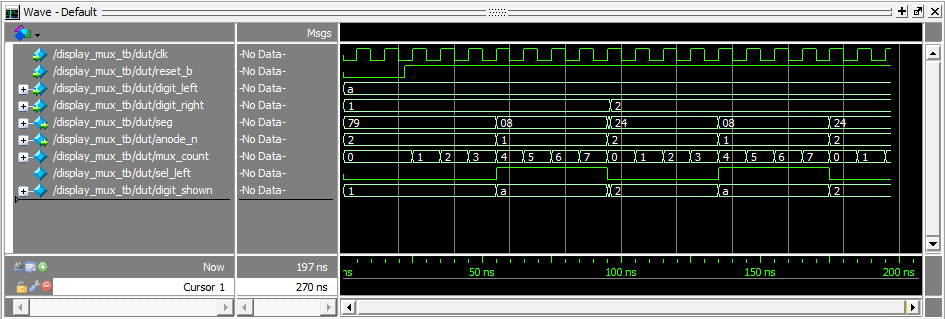

## Introduction

In this lab, a design was implemented on the FPGA that reads a 4x4 matrix
keypad and shows the last two hexadecimal keys pressed on the dual
seven-segment display from Lab 2, with the most recent key on the right. Each
keystroke registers exactly once no matter how long it is held. Switch bounce
is filtered out, and extra keys pressed while one is already held are ignored.
When all but one of several held keys are released, the key still held is
registered.

Most of the Lab 2 design was reused. The Lab 2 row scanner, counter,
seven-segment decoder, and multiplexing logic carry over unchanged. New logic
was added to synchronize the asynchronous column inputs, debounce the key
readings, decide when a press should be registered, and store the last two
digits. As in the previous labs, the design was written in SystemVerilog,
verified in simulation with QuestaSim, and synthesized in Lattice Radiant for
the iCE40 UP5K.

## Design and Testing Methodology

### Design Overview

The keypad rows are driven one at a time through 2N3904 low-side transistors,
and the columns are read back through pull-up resistors. A pressed key
connects its row to its column, so while its row is driven the column is
pulled low. Because the transistors invert, the FPGA drives its row pins
one-hot high so that exactly one keypad row is pulled low.

The whole design runs on the 48 MHz HSOSC clock. Slower rates (row scanning,
debounce sampling, and display multiplexing) are produced as one-cycle
enables or counter bits.

### Modules

Reused unchanged from Lab 2 (counter, scanner, and sevenseg_decoder are
identical to the Lab 2 source):

- counter.sv: Parameterized counter with enable and asynchronous
  active-low reset that wraps at MAX. It is used in scanner, tick_gen, and
  display_mux.
- scanner.sv: Lab 2 row scanner. It counts to 4*DIV and decodes a one-hot
  row pattern. Its enable is now driven by the keypad controller so that it
  can be halted on the row of a pressed key.
- sevenseg_decoder.sv: Maps a hex nibble to an active-low segment
  pattern.

New in Lab 3:

- synchronizer.sv: A two-flop synchronizer on the four asynchronous
  column inputs.
- key_decoder.sv: Combinational decode of the (row, column) reading into
  a hex value, plus two status bits.
- tick_gen.sv: A free-running counter that pulses a one-cycle tick
  strobe every 2^TICK_W cycles.
- debouncer.sv: A three-state FSM (IDLE/WAIT/PRESSED) that samples
  its input on the tick strobe
- keypad_ctrl.sv: The keypad controller FSM (SCAN/PRESS/HOLD/MULTI). It
  contains the tick generator, both debouncers, and the Lab 2 scanner, and it
  registers the active-low row pattern. It also delays that pattern by the
  synchronizer depth (SYNC_DEPTH = 2) to produce `rows_aligned`, so each
  synchronized column reading is decoded against the row that was driven
  when it was taken.
- digit_reg.sv: A two-digit shift register.
- display_mux.sv: The Lab 2 multiplexing logic packaged as a module. The
  MSB of a counter selects the left or right nibble, drives a single shared
  decoder, and picks the anode.
- lab3_GA.sv: The top level. It contains only the HSOSC, module
  instances, and the `key_new` compare (`key != d0`).

### FSMs

The design is split into communicating state machines, following the
controller/counter pattern from lecture.

1. Scanner ↔ controller. The scanner
   steps through the rows. The controller sends scan_en down to it, which
   is high only in SCAN while no raw key reading is present. The raw
   any_key reading acts as the signal coming back up. As soon as a column
   reads low, the scanner freezes on that row, so the key's reading stays
   present while it is being debounced.
2. tick_gen → debouncers → controller. tick_gen is a counter that sends
   a strobe to both debouncers. The debouncers pass clean key_down and
   single_key levels up to the controller.
3. Controller → datapath. The controller's only output is the one-cycle
   capture pulse. That pulse is the enable
   for digit_reg, the plain datapath register holding the last two digits.

### Switch Debouncing Strategy

Rather than debouncing the four raw column bits, the design debounces the two
conditions the controller actually branches on: "a key is down" and "exactly one key is down" (`one_key`). Each debouncer samples its input
only on the tick strobe:

- IDLE → WAIT when the input is high at a tick.
- WAIT → PRESSED at the next tick, but only if the input stayed high on
  every clock cycle in between. Any low cycle (a bounce) returns to IDLE.
- PRESSED → IDLE on the first low cycle.

A press is therefore accepted only after it has been continuously stable for
at least one full tick period. That is 10.9 ms, longer than the few
milliseconds that contact bounce lasts. The release is not debounced, which
makes the controller react to releases immediately. Release bounce cannot
cause a second registration, because re-entering PRESSED needs another full
tick-to-tick window of stable contact, which a bounce cannot provide.

### Multiple Key Presses

The scanner halts on the row of the first key detected, so keys pressed later
in other rows are never seen while the first is held. A second key in the
same row makes one_key drop, and the controller moves from HOLD to MULTI
without registering anything. From MULTI, the controller registers again only
when exactly one key is left down and that key differs from the digit
already on the display. This means releasing all but one key
shows the remaining key, while releasing back to the key that was already
registered does not register it twice.

Because the scanner stops on the first row where it sees a key, two keys in
different rows pressed at the same moment (for example 8 and 5, which share
a column) look like a single key. The key in whichever row the scanner
reaches first is registered, and the other is ignored until the first is
released. Releasing it sends the controller back to SCAN, the scanner
resumes, finds the key that is still held, and registers it after the
normal debounce.

## Technical Documentation

The source code, testbenches, and AI prototype code for this lab can be found
in this [GitHub repository](https://github.com/GabeAlencar/hmc-e155-portfolio/tree/main/labFiles/lab3).

### Block Diagram

Figure 1 shows the top-level module and the keypad_ctrl submodule.

### Schematic

Figure 2 shows shematic including the keypad with column pull-ups, the
2N3904 row drivers, and the dual seven-segment display with its anode
transistors and segment resistors.

## Results and Discussion

The design was programmed onto the FPGA and tested on the breadboard. Each key displayed the
correct hex value, the newest digit appeared on the right with the previous
one shifted left, and each press registered exactly once however long it was
held. Holding one key and pressing others had no effect, and releasing all but
one key displayed the remaining key. Both digits were steady with equal
brightness and no flicker.

### Testbench Simulation

The following simulations were run in QuestaSim to verify the design before
programming it onto hardware.

Figure 6 shows the synchronizer. Its output is 0 while reset is held. Each
new value on d (f, e, 5, b) shows up on the first flop n1 after one clock
edge and on the output q after two. The reset pulse near 105 ns clears both
flops, and the held value b passes through again once reset is released.

Figure 7 shows the key decoder. With no column pulled low, any_key and
one_key are both low. Each row (e, d, b, 7) is then driven against each
single column, and key steps through the keypad layout 1, 2, 3, A / 4, 5, 6,
B / 7, 8, 9, C / E, 0, F, D, with one_key high. At the end, two keys, four
keys, and a non-adjacent pair of columns in the same row keep any_key high
but drop one_key.

Figure 8 shows the tick generator with a small TICK_W. tick is low during
reset, and after that it pulses for exactly one cycle each time count
reaches its last value. The reset pulse near 820 ns sends count back to 0,
and the next tick comes a full period later.

Figure 9 shows the debouncer (state 1 = IDLE, 2 = WAIT, 4 = PRESSED). A short
glitch between ticks never leaves IDLE, and a press that drops before the
next tick falls back from WAIT to IDLE. A press held across two ticks goes
IDLE -> WAIT -> PRESSED and raises debounced_sw, and releasing it drops back
to IDLE right away. The bouncy press and release near 1.3 us and 1.7 us each
produce only one rising edge on debounced_sw. The last press is cleared by
a reset while in PRESSED.

Figure 10 shows the keypad controller. The rows rotate one-hot every
SCAN_DIV cycles until a key is seen, and the scanner then halts on that row.
A single press of 8 produces one capture pulse. With 8 and 5 held together,
releasing 8 leaves 5 down, which is then captured once.

Figure 11 shows the digit register. After reset both digits are 0, and they
hold while enable is low even though key changes. Each enable pulse shifts
the new key into d0 and the old d0 into d1 (5, then A, then F), and the
oldest digit drops off. Entering F a second time fills both digits with F,
and the reset near 175 ns clears the display back to 00.

Figure 12 shows the display multiplexer. digit_sel toggles every half period
of mux_count, and anode_n switches between the two digits with it, so
exactly one anode is on at a time. nibble alternates between digit_left and
digit_right, and seg carries the decoded pattern. digit_left steps 0 to F
and digit_right steps F to 0, covering all 16 hex values on both digits.
Holding F/0 shows equal on-time for each digit. When digit_left changes to
E, seg updates right away, and the display resets near 2.05 us.

## Conclusion

The design reads a 4x4 keypad and displays the last two keys pressed. It
registers every press exactly once, filters out switch bounce, and handles
multiple simultaneous presses. It reuses the Lab 2 scanner, counter, and
display logic without modification. I spent a total of 20 hours
working on this lab.

## AI Prototype Summary

For this lab's AI prototype, I compared a single monolithic prompt against the three decomposed prompts. Both prototypes compiled with zero errors and
zero warnings in QuestaSim. Without being told to, Prototype A split itself
into four modules (tick_gen, keypad_scanner, display_mux, and a top level)
in one file. That is close to how I partitioned my own design. The main
difference is that it merged scanning, debouncing, and single/multi press into a single FSM. Prototype B's prompts forced the split I would
have chosen (a scanner FSM and a separate one-shot FSM). Each module on its
own was cleaner and better commented. Overall, the monolithic prompt produced a clear whole system while the decomposed prompts produced better individual modules. Decomposing only
pays off if each prompt also states the interface contract with the modules
around it and how the downstream module must react. Next time I would decompose, but give each
prompt the other modules' ports and timing assumptions, plus the board's
physical row/column wiring and other information like polarity.