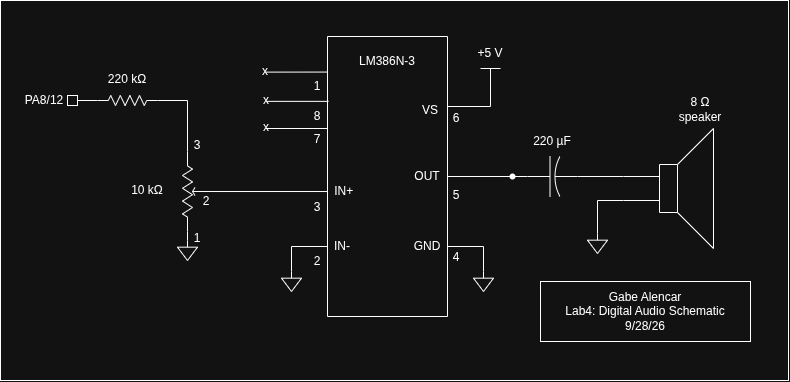

## Introduction

In this lab, the STM32L432KC microcontroller was programmed to play music on
an 8 Ω speaker. The MCU reads a list of notes, each given as a pitch in Hz and
a duration in ms, and produces a square wave at each pitch for the given
duration. A pitch of 0 is a rest, and a duration of 0 marks the end
of the song. The songs Für Elise and Happy Birthday are played.

The GPIO pin cannot drive a speaker directly, so the square wave passes
through a resistor divider and a volume potentiometer into an LM386 audio
amplifier, which drives the speaker. This was the first lab on the MCU. All
peripheral access is done through my own #define base addresses and register
structs, written from the RM0394 reference manual. The code was written in C in SEGGER Embedded
Studio and downloaded to the board over the on-board J-Link.

## Design and Testing Methodology

### Timer Selection

- TIM1 makes the pitch. It runs in PWM mode 1
  on channel 1 and drives PA8 directly through alternate function AF1.
- TIM2 times each note. It runs in one-pulse
  mode as a blocking delay, using the initTIM() / delay_millis().

### Register-Level Drivers

- STM32L432KC_RCC.h/.c: RCC register struct at 0x40021000, the clock
  configuration tutorial's field values and functions (enableHSI16(),
  selectSysclk(), setAHBPrescaler(), configurePLL()), and
  configureClock().
- STM32L432KC_GPIO.h/.c: GPIO register struct (GPIOA at 0x48000000),
  plus gpioEnable(), pinMode(), pinAltFunction(), and digitalWrite().
- STM32L432KC_TIM.h/.c: A timer register struct shared by TIM1, TIM2,
  TIM15 and TIM16 (TIM1 at 0x40012C00, TIM2 at 0x40000000), plus
  initPWM(), setPWMFreq(), initTIM(), and delay_millis().
- STM32L432KC.h: Top-level header with the clock frequency constants.
- main.c: The two scores and the playSong() loop.

### Pitch Generation (TIM1)

initPWM() disables slave mode (SMCR = 0) and sets PSC = 15. It puts
channel 1 in PWM mode 1 (OC1M = 0110) with CCR1 preload, then enables the
channel output (CC1E) and the main output (MOE) and starts the counter.
For each note, setPWMFreq() computes the period in ticks, rounded to the
nearest integer, and writes ARR = N − 1 and CCR1 = N/2 for a 50 % duty
cycle. It then forces an update event so the new pitch takes effect
immediately. A rest writes CCR1 = 0, which holds the output low for the
whole note.

### Song Player

playSong() walks through a {pitch, duration} array until it reaches a
duration of 0. For each entry it calls setPWMFreq() and then
delay_millis(). 

## Technical Documentation

The source code for this lab can be found in this
[GitHub repository](https://github.com/GabeAlencar/hmc-e155-portfolio/tree/main/labFiles/lab4).

### Calculations

#### Pitch and timer configuration

TIM1 counts 0, 1, …, ARR and then wraps, so one period of the output is N = ARR + 1 ticks:

$$
f_{out} = \frac{f_{TIM}}{(PSC+1)(ARR+1)} = \frac{16\ \text{MHz}}{16\cdot N} = \frac{10^6\ \text{Hz}}{N}
$$

The code picks the nearest integer, N = (1000000 + f/2) / f, then sets ARR = N − 1 and CCR1 = N/2 for a 50 % duty cycle.

#### Duration and timer configuration

TIM2 ticks every 1 µs. For a note of ms milliseconds the code writes ARR = 1000·ms − 1, forces an update (UG, which clears CNT to 0), and starts the counter. 
The counter runs 0 … ARR, so the overflow comes after ARR + 1 = 1000·ms ticks, which is exactly ms milliseconds.
 One-pulse mode stops the counter at that overflow, and URS = 1 makes sure only the real overflow sets UIF. The code then waits on UIF.

#### 220 Hz and 1000 Hz within 1 %

TIM1 is clocked at $f_{TIM} = 16\ \text{MHz}$ with $PSC = 15$, so the counter clock is

$$
f_{CNT} = \frac{f_{TIM}}{PSC+1} = \frac{16\ \text{MHz}}{16} = 1\ \text{MHz}
$$

The counter runs $0 \dots ARR$ and wraps, so one output period is $N = ARR + 1$ ticks:

$$
f_{out} = \frac{f_{TIM}}{(PSC+1)(ARR+1)} = \frac{10^6\ \text{Hz}}{N},
\qquad N = \text{round}\!\left(\frac{10^6}{f}\right),
\qquad ARR = N-1,
\qquad CCR1 = \frac{N}{2}
$$

220 Hz:

$$
\frac{10^6}{220} = 4545.45 \;\Rightarrow\; N = 4545,\quad ARR = 4544,\quad CCR1 = 2272
$$

$$
f_{out} = \frac{10^6}{4545} = 220.022\ \text{Hz},
\qquad \text{error} = \frac{220.022 - 220}{220} = +0.010\,\% < 1\,\%
$$

1000 Hz:

$$
\frac{10^6}{1000} = 1000 \;\Rightarrow\; N = 1000,\quad ARR = 999,\quad CCR1 = 500
$$

$$
f_{out} = \frac{10^6}{1000} = 1000.000\ \text{Hz},
\qquad \text{error} = 0\,\% < 1\,\%
$$

### Schematic

Figure 1 shows the speaker circuit. The STM32L432KC and header are on the E155 development board and are not redrawn here.
See the
[E155 development board schematic](https://hmc-e155.github.io/assets/doc/E155%20FA22%20Development%20Board%20Schematic.pdf)
for how they are wired.

## Results and Discussion

The design meets all of the specifications.The MCU plays Für Elise and Happy Birthday through an LM386 amplifier,
with a potentiometer for volume. Every pitch is generated by hardware PWM on
TIM1, and every note duration is timed by TIM2. All peripheral access goes through my own
register-level drivers. I spent a total of 15 hours working on this lab.

## AI Prototype Summary

For this lab's AI prototype, I gave Gemini the prompt from the prototype page:

What timers should I use on the STM32L432KC to generate frequencies ranging from 220Hz to 1kHz? What’s the best choice of timer if I want to easily connect it to a GPIO pin? What formulae are relevant, and what registers need to be set to configure them properly?

The output was pretty high quality. It named the
right timer families, gave the correct PWM frequency formula, and listed
almost exactly the register sequence my final initPWM() uses: PSC, ARR,
CCR1, OC1M = 0110, OC1PE, CC1E, ARPE, UG and CEN. It also flagged the
BDTR.MOE bit that advanced timers need. Getting that list from RM0394 by hand means tons of saved time. The LLM was much
faster at telling me what to search for.

That being said, it still had no context and didn't know about any of the pins. It also assumed
the default 4 MHz clock, while my design switches to HSI16 at 16 MHz, so its
example ARR values did not apply. Compared with the earlier HDL-generation prototypes, the LLM works better as a
documentation search tool. Its answers are easy to check against the manual. Generated HDL, on the other hand, can look
right and hide issues.