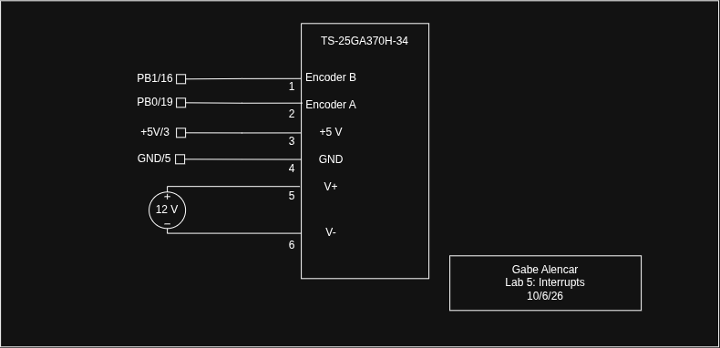

## Introduction

In this lab, the STM32L432KC was programmed to measure the speed and direction
of a 25GA370 brushed DC gear motor from its hall-effect quadrature encoder. The
encoder has two outputs, A and B, which are square waves about 90° apart. Every
rising and falling edge on both channels triggers an interrupt, and the
interrupt handlers keep a signed count of the encoder steps. A timer interrupt
clocked by a 32.768 kHz crystal samples that count every 0.5 s. The main loop
converts each sample to revolutions per second and prints the speed and
direction to the SEGGER Debug Terminal at 2 Hz.

The Lab 4 RCC, GPIO, and timer drivers were reused and extended, for example
with digitalRead(), pinResistor(), and periodic timer interrupts. New drivers were written
for the EXTI interrupt path (SYSCFG), backup-domain power control (PWR),
and the low-power timer (LPTIM). The new peripherals use the CMSIS device
header (stm32l432xx.h) and registers are accessed by their reference-manual
names (EXTI->PR1, SYSCFG->EXTICR[0], LPTIM1->ARR), and the NVIC is set up
with the CMSIS functions NVIC_EnableIRQ() and __enable_irq(). The Lab 4
driver functions are reused, but their hand-written register structs
were removed since CMSIS defines the same names (RCC, GPIOA, TIM2, etc.) and both 
cannot be included together.

## Design and Testing Methodology

### Hardware

The motor's six-wire cable carries the motor power (red M+, black M−), the
encoder supply (blue +5 V, green GND), and the encoder outputs (yellow A,
white B). The motor runs directly from a bench supply, so the MCU only reads
the encoder.

The lab page warns that these encoders use 5 V logic. The encoder board pulls
A and B up to its own supply, so they swing from 0 to 5 V, while the
STM32L432KC runs at 3.3 V. A and B therefore go to PB0 and PB1, which are 5 V
tolerant. The internal pull-up and pull-down resistors on PB0 and PB1 are disabled since 
the datasheet requires this for any input above VDD + 0.3 V.

The lab has two versions of this motor. The 25GA370-10 has a 1:10 gearbox and
120 pulses per revolution. The 25GA370-34 has a 1:34 gearbox and 408 pulses
per revolution. The encoder is on the motor shaft and gives 12 pulses per motor
revolution, so the pulses per output revolution are 12 times the gear ratio.
The ratio is a single #define MOTOR_GEAR_RATIO in encoder.h, and every 
other constant is derived from it.

### Quadrature Decoding with Interrupts

An edge on PB0 or PB1 has to pass through five stages to reach its handler.
Stages 1 to 4 are configured in encoderInit(), and stage 5 in main():

1. RCC: the SYSCFG clock is turned on (RCC_APB2ENR.SYSCFGEN).
2. SYSCFG: SYSCFG_EXTICR1 routes port B to EXTI lines 0 and 1.
3. EXTI: both edges are selected (RTSR1 and FTSR1), then the lines are unmasked in IMR1.
4. NVIC: NVIC_EnableIRQ(EXTI0_IRQn) and NVIC_EnableIRQ(EXTI1_IRQn) set
   bits 6 and 7 of ISER0. EXTI0 and EXTI1 are positions 6 and 7 in the vector table.
5. CPU: interrupts are enabled globally with __enable_irq(), which is the
   cpsie i instruction that clears PRIMASK. The handlers are named
   EXTI0_IRQHandler and EXTI1_IRQHandler to match the vector table.

Both handlers do the same work. Each one first checks and clears its EXTI
pending bit, so an edge that arrives while the handler runs raises a new
interrupt. It then reads both A and B and looks up the change from the previous state 
in a 16-entry table:

- A step with A leading B adds 1 (CW), and a step with B leading A subtracts
  1 (CCW). A glitch on one channel gives a +1 and a −1, which cancel. 
- No change adds 0.
- A jump of two states means both channels changed between two reads, so one
  edge was missed. This is counted in invalid_count. It is not printed, but it 
  can be watched in the SEGGER debugger.

Every edge of both channels is counted, so each encoder pulse gives 4 counts,
which is 1632 counts per output revolution for the 1:34 motor. Counting state
changes also makes the measurement independent of the exact phase between A
and B.

The direction comes from the order of the edges. ENCODER_CW_SIGN in encoder.h 
holds the sign. It defaults to 1 and is confirmed once per motor part by running the 
motor and watching the shaft. 

The startup order also matters. The EXTI lines are unmasked before the
starting state is read, and the NVIC is enabled only after the read. An edge
before the read is already part of the starting state, and an edge after it
stays latched in EXTI_PR1 until the handler runs, so the first edge always
decodes correctly.

### Velocity Measurement

Speed is measured by counting encoder steps in a fixed window instead of timing
individual edges. A timer interrupt fires every 0.5 s. It saves the difference
between the current count and the count at the previous interrupt, then sets a
flag. The main loop converts that difference to rev/s with floating-point math
and prints it. The encoder and timer interrupts all have the same NVIC priority,
so none of them can interrupt another partway through an update.

The window is timed by LPTIM1, clocked by the Nucleo's 32.768 kHz LSE crystal.
16384 ticks is exactly 0.5 s. The HSI16 oscillator that clocks the CPU and the regular
timers is specified at 15.88–16.08 MHz at 30 °C, plus up to ±1 % from 0 to
85 °C. Every percent of time-base error is a percent of speed error. The Nucleo-L432KC
has no high-speed crystal connected, but its 32.768 kHz crystal is accurate enough.

Starting the crystal takes four steps:

1. turn on the PWR clock (RCC_APB1ENR1.PWREN)
2. unlock the backup domain (PWR_CR1.DBP)
3. set RCC_BDCR.LSEON
4. wait for LSERDY

LPTIM1 is then clocked from the crystal through RCC_CCIPR.LPTIM1SEL. If the crystal has 
not started after 5 s, the code falls back to TIM6 on HSI16 and says so on the terminal. 
The system clock stays on HSI16 at 16 MHz, which is plenty for the interrupt load calculated below.


### Display

printf output goes to the SEGGER Debug Terminal over RTT, because the
project's Library I/O setting is RTT. The only other change needed was turning
on the project's float printf option, so the _write() override from the
tutorial is not needed. At startup the program prints the motor part, the counts 
per revolution, and which time base is in use. Every 0.5 s it prints one line in this format:

```
Speed: x.xxx rev/s   Direction: CW|CCW|stopped
```

The speed is the magnitude, and the direction is given in words.

## Technical Documentation

The source code for this lab can be found in this
[GitHub repository](https://github.com/GabeAlencar/hmc-e155-portfolio/tree/main/labFiles/lab5).

### Calculations

#### Converting pulses to velocity

The encoder gives 12 pulses per motor revolution on each channel, and the
gearbox divides the speed by its ratio $G$. Counting both edges of both
channels gives 4 counts per pulse:

$$
N = 4 \cdot PPR \cdot G
\qquad
G = 34 
\qquad
N = 4 \cdot 12 \cdot 34 = 1632
$$

If $\Delta n$ counts arrive during a window of length $T$, the angular
velocity and direction are

$$
v = \frac{\Delta n}{N \, T}\ \text{rev/s},
\qquad
\text{direction} =
\begin{cases}
\text{CW} & \Delta n > 0 \\
\text{CCW} & \Delta n < 0 \\
\text{stopped} & \Delta n = 0
\end{cases}
$$

#### Update rate

LPTIM1 counts the 32.768 kHz crystal from 0 to ARR = 16383, so

$$
T = \frac{16384}{32768\ \text{Hz}} = 0.5\ \text{s},
\qquad
f_{update} = \frac{1}{T} = 2\ \text{Hz} \ge 1\ \text{Hz}
$$

#### Resolution

One count in one window is the smallest change that can be shown:

$$
\Delta v = \frac{1}{N\,T} = \frac{1}{1632 \cdot 0.5\ \text{s}} = 0.0012\ \text{rev/s}
$$

At the nominal 2.5 rev/s, a window holds $2.5 \cdot 1632 \cdot 0.5 = 2040$
counts, so ±1 count is ±0.05 %. Any motion of at least one count per window, down to
0.0012 rev/s, displays a non-zero speed.

#### Interrupts vs. polling at high speed

A polling loop must look at both pins at least once per encoder state, or it
can see two channels change at once and lose the step. At high speed that
requires

$$
T_{poll} < \frac{1}{4 \cdot PPR \cdot v} = \frac{1}{4 \cdot 408 \cdot 3\ \text{rev/s}} = 204\ \mu\text{s}
$$


A loop with a delay, like the 200 ms delay in the interrupt tutorial's polling example,
  only keeps up below $1/(4 \cdot 408 \cdot 0.2\ \text{s}) = 0.003$ rev/s.
  It would miss nearly every pulse at any useful speed.
A tight loop with no delay could decode fast enough, since one pass is a
  few µs. However, when it comes to formatting and printing, one float takes on 
  many cycles and this cuts into the time you have to sample. 
The tradeoffs are summarized below.

| | Interrupts | Polling |
|---|---|---|
| Time from edge to response | about 0.75 µs to enter the handler, pins read within about 5–15 µs | up to one full loop pass, including any printing |
| CPU time spent on the encoder at 3 rev/s (stopped) | about 4–9 % (0%) | always 100 % |
| Other code in the loop | can take as long as it needs | must finish in under 204 µs |

### Flowchart

Figures 1 to 3 show the main loop and each interrupt handler. Figure 4 shows
how they communicate.

```{mermaid}
%%| fig-cap: "Figure 1: main loop"
flowchart TB
  M0(["main()"]) --> M1["configureClock()<br/>encoderInit()<br/>velocityInit()"]
  M1 --> M2["__enable_irq()"]
  M2 --> M3["wait until sample_ready = 1"]
  M3 --> M4["sample_ready = 0<br/>counts = window_counts"]
  M4 --> M5["rev/s = counts / 816<br/>print speed, direction"]
  M5 --> M3
```

```{mermaid}
%%| fig-cap: "Figure 2: EXTI0/EXTI1 handler (encoder edge)"
flowchart TB
  X0(["EXTI0 / EXTI1:<br/>edge on A or B"]) --> X1["clear pending bit"]
  X1 --> X2["read A, B"]
  X2 --> X3{"both changed?"}
  X3 -- no --> X4["position += step"]
  X3 -- yes --> X5["invalid_count++"]
  X4 --> X6(["prev_state = new<br/>return"])
  X5 --> X6
```

```{mermaid}
%%| fig-cap: "Figure 3: LPTIM1 handler"
flowchart LR
  T0(["LPTIM1 (TIM6):<br/>every 0.5 s"]) --> T1["clear flag"]
  T1 --> T2["window_counts = Δposition<br/>sample_ready = 1"]
  T2 --> T3(["return"])
```

```{mermaid}
%%| fig-cap: "Figure 4: how the handlers and main loop communicate"
flowchart LR
  EX["EXTI handler"] -- position --> TM["timer handler"]
  TM -- "window_counts<br/>sample_ready" --> MN["main loop"]
```
### Schematic



Figure 5 shows the circuit built on the breadboard.See the
[E155 development board schematic](https://hmc-e155.github.io/assets/doc/E155%20FA22%20Development%20Board%20Schematic.pdf)
for how PB0, PB1, +5V, and GND reach the pins.

## Results and Discussion

Overall, the design measures the speed and direction of the encoder motor with
interrupts on both edges of both encoder channels, times each 0.5 s sample
with a crystal-clocked timer, and prints the result twice per second. The ISRs only
update counts and flags, and all conversion and printing happens in the main
loop. I spent a total of 15 hours working on this lab.

## AI Prototype Summary

For this lab's AI prototype, I gave Gemini the prompt from the prototype page in a new chat with no other context:

> Write me interrupt handlers to interface with a quadrature encoder. I'm using
> the STM32L432KC, what pins should I connect the encoder to in order to allow
> it to easily trigger the interrupts?

The answer was high quality. It recommended PA0 and PA1 (A0/A1 on the Nucleo)
because EXTI lines 0 and 1 each have their own interrupt handler, and it
explained that the EXTI line is the pin number regardless of the port. It also
listed the Nucleo pins to avoid, which is the same thing I did when looking through the datasheet.
I had built from the Nucleo user manual. The code it generated was very similar in structure to mine. 
One detail is that differs is that it reads A and B with a single read of the input 
data register instead of two digitalRead() calls.

Overall, the LLM worked very well. It knew the five-stage EXTI path and the same pitfalls 
we covered in lecture. What it could not know again was anything about my hardware.
For example, the pins, LEDs on PA9/PA10, etc.